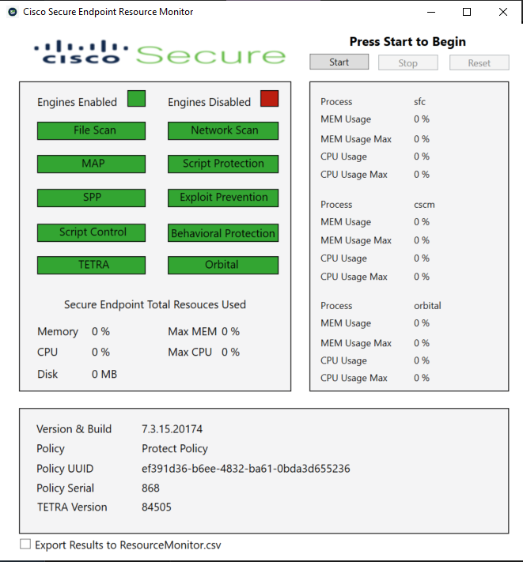

Cisco Secure Endpoint Resource Monitor

Have you ever wondered how many resources the Cisco Secure Endpoint connector is using on your computer?  
If so, download the exe above and you can run this tool (with one of the latest versions of the product) and find out!
I included all of the code so you can review it yourself if you have any concerns.

Before you run the exe, be sure to unblock the file since this is a personal project and it is not signed by Cisco.
Unblock-File -Path C:\Users\YOUR_USERNAME\Downloads\Cisco*

Just click Start to start collecting data and then run any tests you'd like that you think Cisco Secure Endpoint is causing performance issues for.  
Once completed, click Stop.  If you'd like to run another test with new data, click Reset to reset the statistics.

If you need to save or export the data, an option has been included at the bottom that will generate a CSV with all of the info in the same directory.

